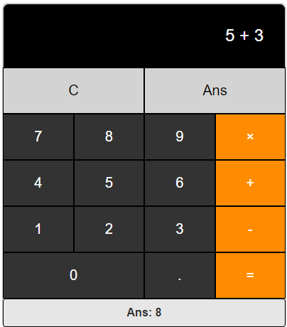

# Simple Vue.js Calculator

A simple calculator built with Vue.js and Vuex. The calculator supports basic arithmetic operations like addition, subtractio and multiplication as well as utilizing the last answer in subsequent calculations.



## Features

- Basic arithmetic operations: add, subtract, multiply
- Use the result of the last calculation in a new calculation
- Clear the current input or use the previous answer with ease

### Installation

First, clone the repository to your local machine:

```
  git clone https://github.com/aizatnazran/simple-calculator.git
```

## Project setup

Go to the project directory

```bash
  cd simple-calculator
```

Install dependencies

```
npm install
```

Serve the application on a local development server

```
npm run serve
```
